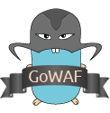

# gowaf
    

`gowaf` is a lightweight MVC framework in Go ([Golang](https://golang.org)) for building fast, scalable and robust database-driven web applications.

# Features
* [x] Postgres, MySQL, SQLite and Foundation database support
* [x] Modular (you can choose which components to use)
* [x] Middleware support. All [alice](https://github.com/justinas/alice) compatible Middleware works out of the box
* [x] Gopher spirit (write golang, use all the golang libraries you like)
* [x] Lightweight. Only MVC
* [x] Multiple configuration files support (currently json, yaml, toml and hcl)

# Overview
`gowaf` is a lightweight MVC framework. It is based on the principles of simplicity, relevance and elegance.

* Simplicity. The design is simple, easy to understand, and doesn't introduce many layers between you and the standard library. It is a goal of the project that users should be able to understand the whole framework in a single day.

* Relevance. `gowaf` doesn't assume anything. We focus on things that matter, this way we are able to ensure easy maintenance and keep the system well-organized, well-planned and sweet.

* Elegance. `gowaf` uses golang best practises. We are not afraid of heights, it's just that we need a parachute in our backpack. The source code is heavily documented, any functionality should be well explained and well tested.

## Motivation
After two years of playing with golang, I have looked on some of my projects and asked myself: "How golang is that?"

So, `gowaf` is my reimagining of lightweight MVC, that maintains the golang spirit, and works seamlessly with the current libraries.

## Installation

`gowaf` works with Go 1.4+

     go get github.com/NlaakStudios/gowaf

# Tutorials

- [create a todo list application with gowaf](https://github.com/gowafframework/tutorials/blob/master/create_todo_list_application_with_gowaf.md)
- [use custom not found handler in gowaf](https://github.com/gowafframework/tutorials/blob/master/set_not_found_handler.md)

## Sample application

- [Todo list](https://github.com/gowafframework/todo)
- [File Upload](https://github.com/gowafframework/upload)
- [chat](https://github.com/gowafframework/chat)

# Contributing

Start with clicking the star button to make the author and his neighbors happy. Then fork the repository and submit a pull request for whatever change you want to be added to this project.

If you have any questions, just open an issue.

# Author
Ultron original Author Geofrey Ernest
Twitter  : [@gernesti](https://twitter.com/gernesti)

GoWAF fork Author
Twitter : [@andrewdonelson](https://twitter.com/andrewdonelson)

# Acknowledgements
These amazing projects have made `gowaf` possible:

* [gorilla mux](https://github.com/gorilla/mux)
* [ita](https://github.com/gernest/ita)
* [gorm](https://github.com/jinzhu/gorm)
* [alice](https://github.com/justinas/alice)
* [golang](http://golang.org)

# Licence

This project is released under the MIT licence. See [LICENCE](LICENCE) for more details.
